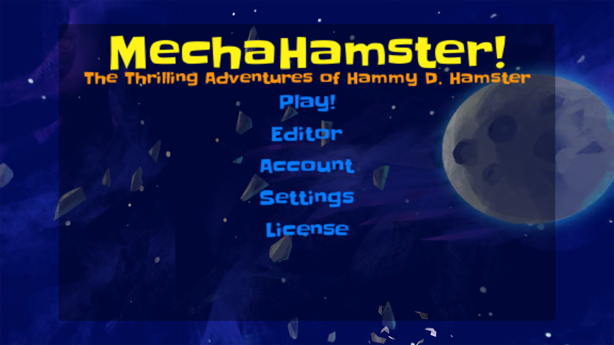
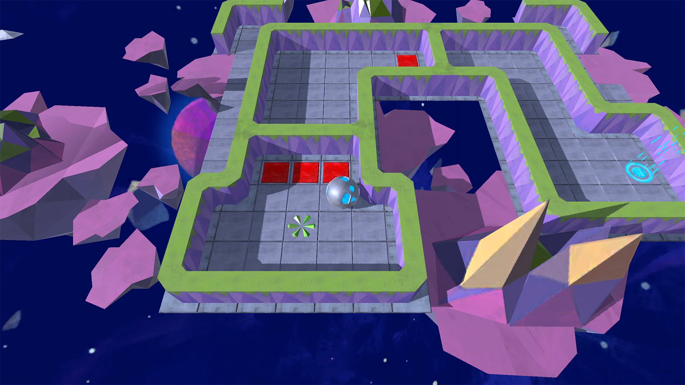
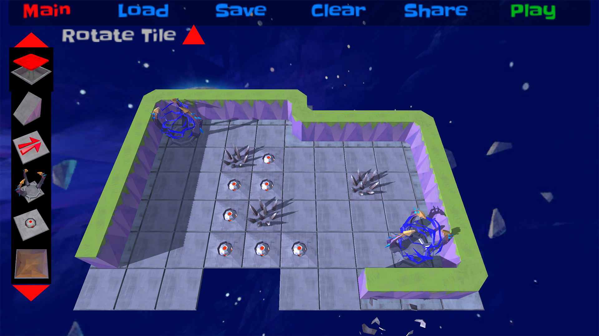

MechaHamster
======

[MechaHamster][] is a game about guiding a futuristic hamster ball through dangerous space mazes, 
create mazes of their own, and share them with friends.  Can you guide Major Hammy D. Hamster to
safety?

## Motivation

[MechaHamster][] serves as a demonstration, sample, and reference for integrating
[Firebase][] with the [Firebase Unity SDK][], and [Daydream][] with the [Google VR SDK for Unity][]
into a game project.

<iframe width="560" height="315"
    src="https://www.youtube.com/embed/0mhYrDJ5Dfw"
    frameborder="0" allowfullscreen>
</iframe>

## Overview

MechaHamster demonstrates the following concepts:

   * Mobile and [Daydream][] play modes.
   * [Firebase Analytics][] to measure various aspects of user behavior.
   * [Firebase Authentication][] to associate user generated content with users.
   * [Firebase Realtime Database][] to store map and user data in addition to sharing content.
   * [Firebase Cloud Messaging][] to allow game admins to send push notifications which inform users
     of new map content.
   * [Firebase App Invites][] to share user generated content with other players.
   * [Firebase Remote Config][] to allow game admins to run experiments on game data without
     redeploying a new build of the game.

## Downloading

[MechaHamster][] source code can be downloaded from [Github][].

## Building

   * Open the project in at least [Unity 5.6 beta][], this is required for the
     [Google VR SDK for Unity][].
   * Download the [Firebase Unity SDK][] and unzip.
   * Import the following plugins - using `Assets > Import Package > Custom Package` menu item -
     from the [Firebase Unity SDK][]:
      * FirebaseAnalytics.unitypackage
      * FirebaseAuth.unitypackage
      * FirebaseDatabase.unitypackage
      * FirebaseInvites.unitypackage
      * FirebaseMessaging.unitypackage
      * FirebaseRemoteConfig.unitypackage
   * Select a target platform (iOS or Android) using the `File > Build Settings` menu option.
   * Add Firebase to your app using either the [Firebase Unity SDK iOS Setup][] or
     [Firebase Unity SDK Android Setup][].
   * Wait for the spinner (compiling) icon to stop in the bottom right corner of the Unity status bar.
   * Finally, select the `File > Build Settings` menu option then click `Build and Run`.

## Documentation
To contribute the this project see [CONTRIBUTING][].

  [Android]: https://www.android.com/
  [CONTRIBUTING]: https://github.com/google/mechahamster/blob/master/CONTRIBUTING.txt
  [GitHub]: https://github.com/google/mechahamster/
  [Google]: https://google.com
  [Firebase]: https://firebase.google.com/docs/
  [Daydream]: https://developers.google.com/vr/daydream/overview
  [Google VR SDK for Unity]: https://developers.google.com/vr/unity/
  [MechaHamster]: https://github.com/google/mechahamster/
  [Firebase Unity SDK]: https://firebase.google.com/docs/unity/setup
  [Unity 5.6 beta]: https://unity3d.com/unity/beta]
  [Firebase Unity SDK iOS Setup]: https://firebase.google.com/docs/unity/setup#add_firebase_to_your_app
  [Firebase Unity SDK Android Setup]: https://firebase.google.com/docs/unity/setup#add_firebase_to_your_app_1
  [Firebase Realtime Database]: https://firebase.google.com/docs/database/
  [Firebase Analytics]: https://firebase.google.com/docs/analytics/
  [Firebase Authentication]: https://firebase.google.com/docs/auth/
  [Firebase Cloud Messaging]: https://firebase.google.com/docs/cloud-messaging/
  [Firebase Remote Config]: https://firebase.google.com/docs/remote-config/
  [Firebase App Invites]: https://firebase.google.com/docs/invites/
